# Qwiker

### Qwiker taxi app for passengers
### Qwiker drivers app for drivers

MVVM Architecture, iOS 15+, device: iphone.

### The app is like an Uber

 - Firebase auth phone 
 - Interactive map view 
 - Display drivers on map
 - Utilizes geolocation to load drivers near user location for optimal performance 
 - Driver locations update on map in real time

 - Passengers can request rides from registered drivers on the app
 - Location search auto completion 
 - Saved locations 
 - Trip request system sorted by closest driver to user requesting trip using geolocation
 - Different ride types with custom pricing model 
 - Drivers can either accept or reject trip requests 
 - Drivers can enable an active status to receive ride requests or go offline
 
 - User is notified when driver arrives using geolocation 
 - Custom views for every stage of the trip for both passengers and driver 
 - Trip can be cancelled by either driver or passengers 
 - Users can view trip history 

## Includes ( ALL SWIFTUI )
- Combine Framework
- Firebase Auth + Database + Storage
- Custom Modifiers
- MapKit
- AppleMap 
- GeoHash

## Video 📷

## Screenshots 📷

- Driver App

 

 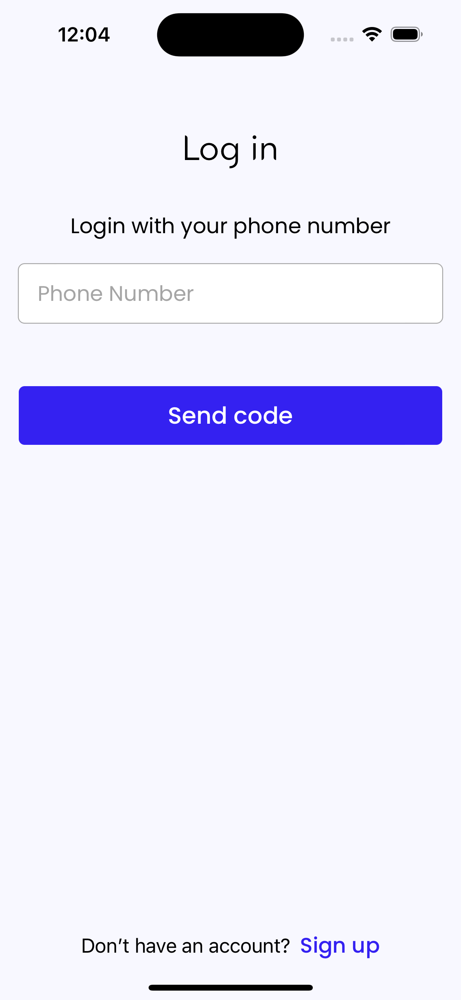
 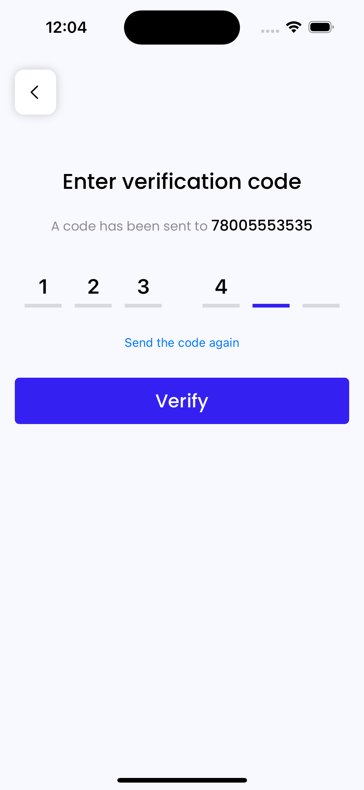
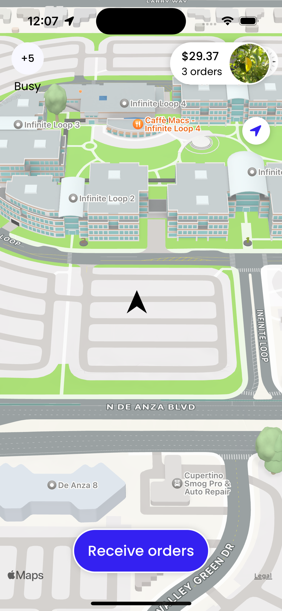
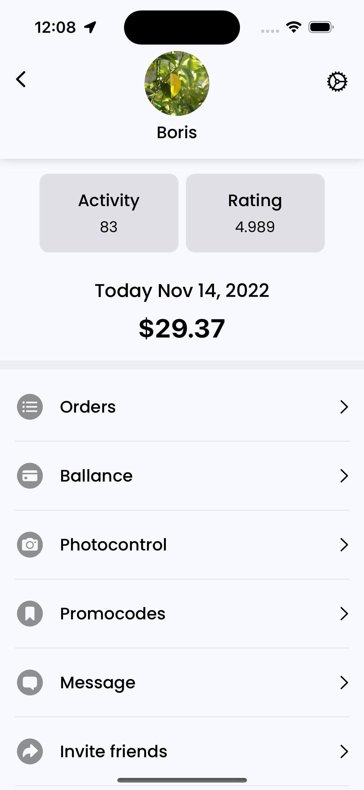
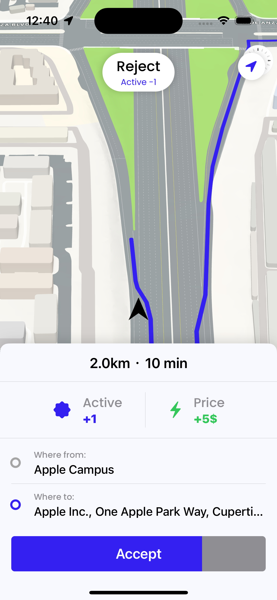
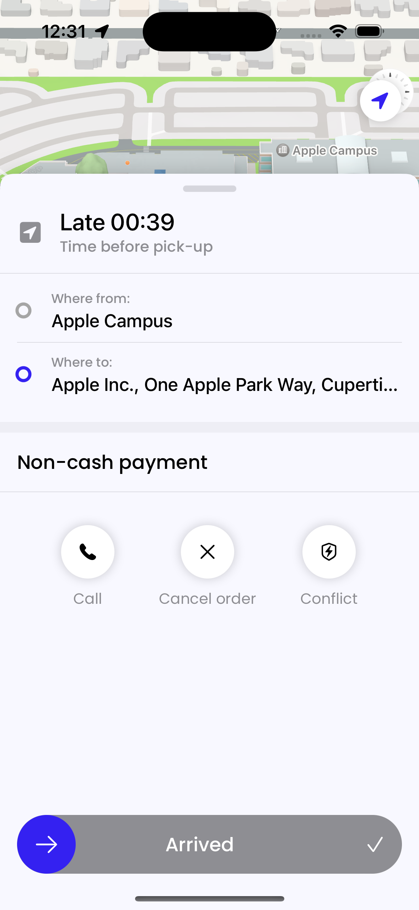
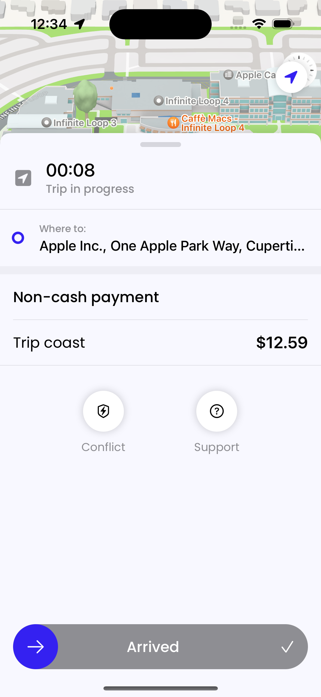
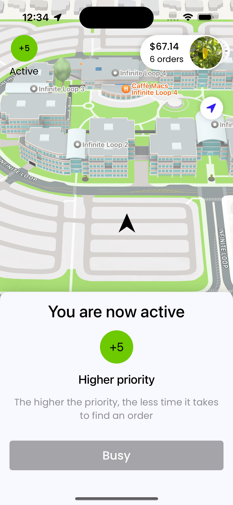
   

   
   
- Passenger App

 

 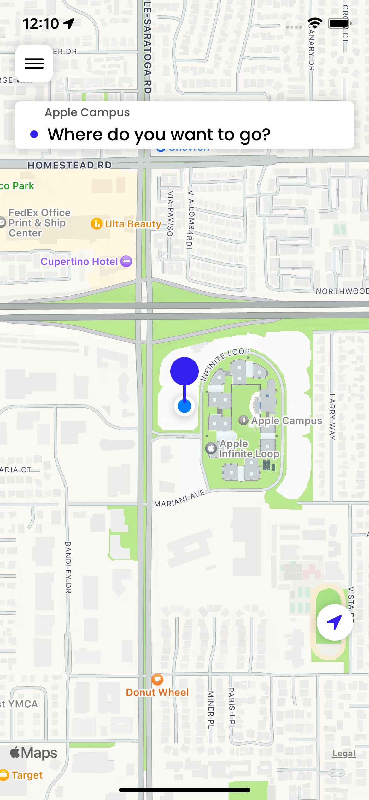
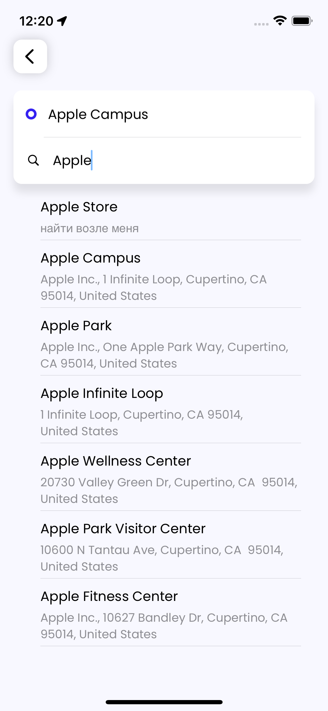
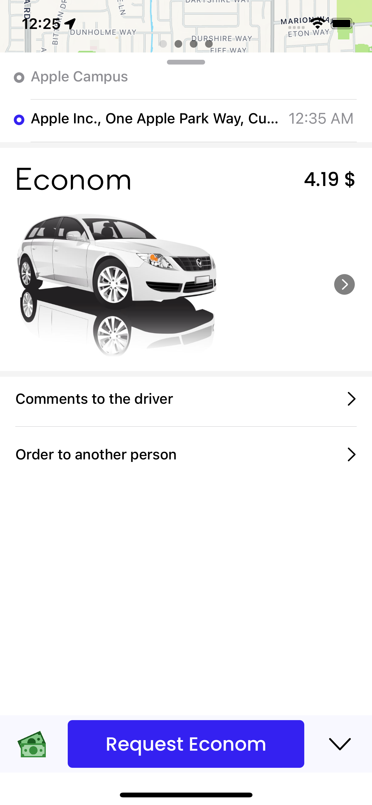
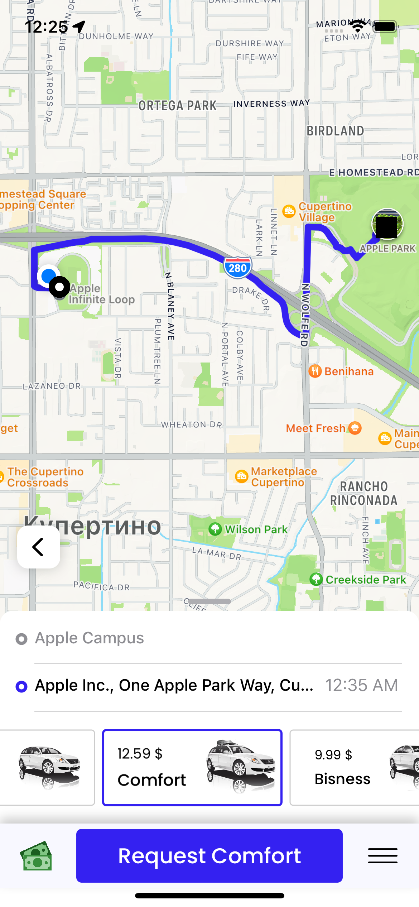
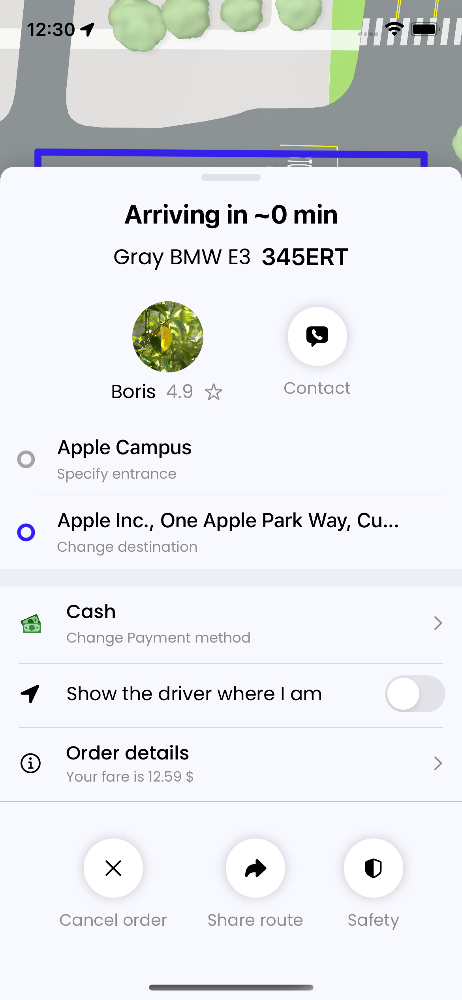
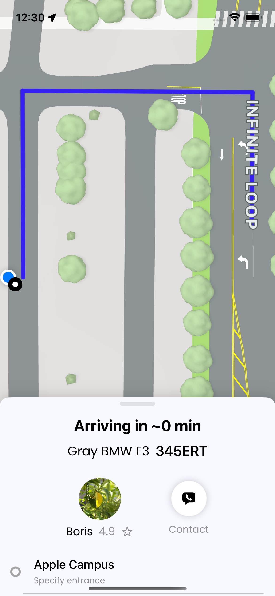
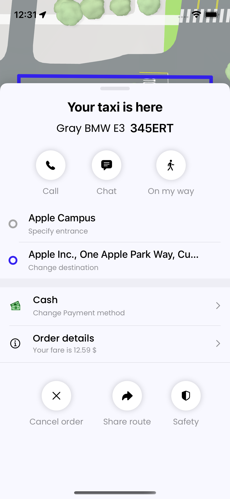
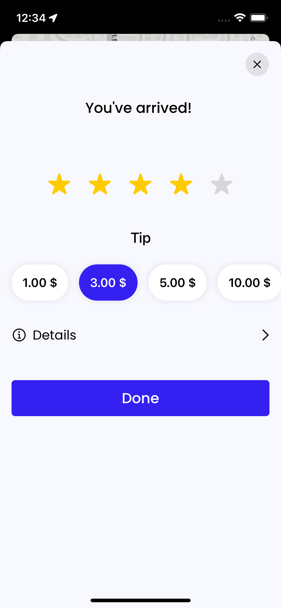

   

## Author
* [Bogdan Zykov](https://github.com/BogdanZyk)

## License

 Copyright 2022 Bogdan Zykov.
 Licensed under MIT License: https://opensource.org/licenses/MIT
